

  

<h1 align="center">Phần 1: Tổng quan MCU & Kiến trúc Kit</h1>

  <b>Khám phá sức mạnh phần cứng của dòng Alif Ensemble E7 - Bước đột phá trong xử lý AI tại biên.</b>

---

## 💎 1. Giới thiệu Alif MCU Family

Alif Semiconductor mang đến dòng vi điều khiển **Ensemble™** được thiết kế từ đầu để giải quyết các thách thức về hiệu suất và tiêu thụ năng lượng cho ứng dụng AI/ML.

- **Dòng E1:** Hiệu suất cơ bản, tiết kiệm năng lượng.
- **Dòng E3:** Cân bằng giữa xử lý tín hiệu và AI.
- **Dòng E7 (Trọng tâm):** Đỉnh cao hiệu suất với cấu trúc nhân kép (Dual-core) và NPU chuyên dụng.

| Family   | Quad-core | Triple-Core | Dual-core | Single-core |
| :------- | :-------- | :---------- | :-------- | ----------- |
| Ensemble | E7        | E5          | E3        | E1          |

Các thiết bị chia sẻ một tập hợp các thiết bị ngoại vi và sơ đồ quản lý năng lượng chung, giúp đơn giản hóa việc tái sử dụng phần mềm và phần cứng trong các dự án đa dạng. Tài liệu này sẽ trình bày chi tiết về MCU E7 với kiến trúc Quad-core.

## 2. Kiến trúc Alif Ensemble E7

### 2.1. Kiến trúc tổng quan

E7 không chỉ là một MCU thông thường, nó là một hệ thống phức hợp (SoC) bao gồm các phân vùng chức năng riêng biệt. Thiết kế hệ thống nhúng tốt thường xử lý các thách thức như: Hiệu suất cao nhưng phải tiết kiệm điện, linh hoạt nhưng vẫn phải bảo mật tốt. Chính vì đó kiến trúc của ALIF MCU được thiết kế để giải quyết các thách thức đó.

  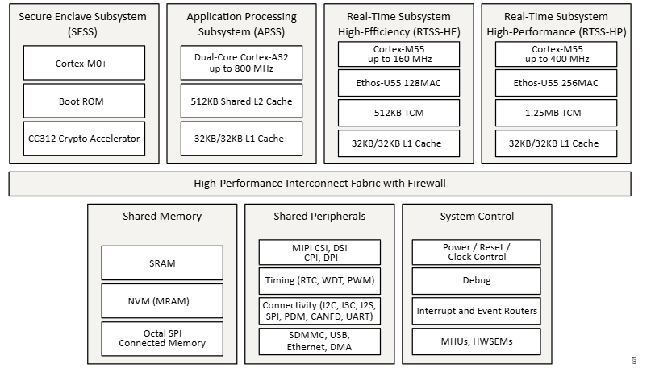
   
  <em>Hình 2.1: Kiến trúc hệ thống MCU E7</em>

Kiến trúc hệ thống bao gồm nhiều hệ thống con (subsystem) được tối ưu hóa cho các vai trò chuyên biệt. Mỗi subsystem có 1 hoặc 2 CPU (E7 có 2 CPU Cortex A32), tùy chọn NPU (E7 có 2 NPU Ethos U55), bộ nhớ và các thiết bị ngoại vi. Mỗi subsystem hoạt động trên một miền năng lượng riêng và tất cả đều được kết nối vào 1 đường bus tốc độ cao chung kèm theo các chế độ bảo mật (Firewalls). Mỗi khối có thể thực thi độc lập tuy nhiên nhờ bus chung thì có thể chia sẻ chung bộ nhớ và các ngoại vi.

### 2.2. SESS - Secure Enclave Subsystem

SESS có vai trò là người giám sát hệ thống. SESS thực hiện cấu hình hệ thống ban đầu sau khi reset, khởi động an toàn các hệ thống con ứng dụng và phản hồi các yêu cầu dịch vụ từ chúng sau đó. Cứ hiểu SESS như là bảo vệ trường, trước khi các lớp học bắt đầu thì bảo vệ sẽ kiểm tra tất cả để đảm bảo an ninh, mở khóa các phòng sau đó mới đến học sinh và giáo viên hoạt động. Và vì là một người giám sát/bảo vệ nên khối này sẽ hoạt động 24/24 khi được cấp nguồn.  
Hình 2-2 cho thấy cấu trúc SESS.

  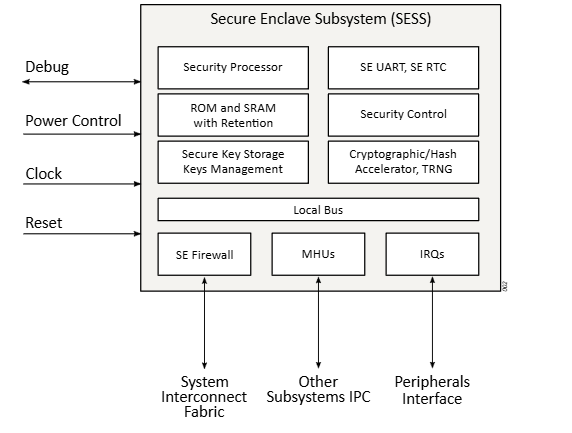
   
  <em>Hình 2.2: Kiến trúc Secure Enclave Subsystem</em>

SESS có ROM/SRAM và bộ xử lý riêng biệt tách riêng hẳn so với. Nó cũng có các khối riêng **chuyên** cho bảo mật như bộ tạo số ngẫu nhiên, băm, mã hóa. Ngoài ra nó còn có kho quản lý các khóa an toàn bất biến (chỉ Alif biết).
Trong đường truyền bus chung, SESS đóng vai trò như thiết bị chủ (Bus master). Nó hoàn toàn có thể đọc/ghi vào bộ nhớ chung, (như truy cập MRAM để lấy thông tin cấu hình hệ thống, đọc/ghi image để boot) và thiết lập các thiết bị ngoại vi (như cấu hình Firewall, Pin Mux, Clock, bộ định tuyến ngắt). Tuy nhiên chiều ngược lại đọc ghi và SRAM, ROM nội SESS thì không, như kiểu bảo vệ có thể vào lớp học sắp đặt bàn ghế, đưa mic, bật điện điều hòa, tivi, nhưng học sinh và giáo viên thì chưa chắc có quyền vào phòng bảo vệ. Các khối giao tiếp bằng MHUs (_Khái niệm này sẽ được giải thích ở 3. Luồng dữ liệu_)  
Các chức năng và dịch vụ của SESS được tóm tắt dưới đây:

Khởi động và cấu hình thiết bị

- Bộ nạp khởi động an toàn: Giai đoạn 1 (SEROM) và giai đoạn 2 (SERAM).
- Cấu hình thiết bị: Thiết lập các thông số hệ thống ban đầu.
- Cập nhật Firmware: Đảm bảo quá trình cập nhật chương trình cơ sở diễn ra an toàn.

<b>Quản lý khởi động ứng dụng</b>

- Secure Boot: Khởi động an toàn cho các hệ thống con ứng dụng.
- Khởi động theo yêu cầu: Kích hoạt các subsystem khi cần thiết.

<b>Dịch vụ ứng dụng & Hạ tầng</b>

- Cấu hình phần cứng: Pin (Ghim), Bộ định tuyến ngắt (Interrupt Router), Bộ định tuyến sự kiện IRQs, Tạo xung nhịp (Clock).
- Tiện ích: Bảo trì Secure Enclave (OTP, ISP MRAM), Trình điều phối dịch vụ (MHU Driver).

<b>Quản lý Nguồn & Bảo mật hệ thống</b>

- Nguồn/Đặt lại: Quản lý chế độ STOP, logic đánh thức (Wake-up), điều khiển DC-DC.
- Root-of-Trust: Lưu trữ khóa riêng tư, định danh và xác thực thiết bị.
- Mật mã: Quản lý khóa, TRNG (Tạo số ngẫu nhiên thực), xác minh chữ ký, AES SPI.
- Vòng đời: Kiểm soát eFuse và xác thực phiên gỡ lỗi (Debug).

### 2.3. APSS Application Processor Subsystem

là một khối vi xử lý được tối ưu hóa để chạy các ứng dụng nhúng yêu cầu hiệu năng cao, điển hình là hệ điều hành Linux hoặc các Hệ điều hành Thời gian thực (RTOS) có hỗ trợ đa xử lý đối xứng (SMP) **hoạt động ở 800Mhz**.

  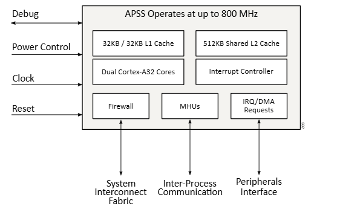
   
  <em>Hình 2.3: Kiến trúc Application Processor Subsystem</em>

APSS lưu trữ tối đa hai lõi Arm Cortex-A32 được trang bị một lượng bộ nhớ đệm dồi dào. Mỗi lõi Cortex-A32 có 32KB Instruction và 32KB Data L1 Cache. Cả hai lõi đều chia sẻ 512KB L2 Cache với bộ điều khiển kết hợp bộ nhớ đệm tích hợp. Kích thước bộ nhớ đệm được chọn để tối đa hóa hiệu suất của bộ xử lý, do các khối bộ nhớ hệ thống có băng thông khác nhau và hạn chế. Cách tiếp cận này cho phép cân bằng giữa hiệu suất và hiệu quả năng lượng.APSS không có NPU xử lý AI nhưng  được tích hợp phần cứng hỗ trợ Arm Neon Advanced SIMD (tăng tốc xử lý vector/đồ họa) Double-Precision FPU (tín toán phẩy động). Nó không phải NPU chuyên dụng cho xử lý ma trận nhưng vẫn có thể thực hiện khoảng 4 phép toán số thực hoặc 8-16 phép toán số nguyên trong 1 chu kỳ lệnh. APSS xử lý AI chậm hơn RTSS(NPU) nhưng bù lại nó khá linh hoạt, có thể chạy bất kỳ thuật toán nào như OCR phức tạp hay NLP phức tạp, trong khi NPU nếu gặp phải các model ai có những lớp layers lạ mà nó không hỗ trợ thì NPU sẽ bó tay.

### 2.4. RTSS - Real-time Subsystem

Trên E7 được trang bị 2 subsystem RTSS khác nhau là RTSS-HP (High Performance) và RTSS-HE (High Effecient). Mỗi khối được trang bị 1 CPU Cortex-M55 với bô nhớ chặt chẽ TCM và một NPU-U55. RTSS hiệu năng cao (RTSS-HP) được tối ưu hóa để có hiệu suất điện toán nhanh và RTSS hiệu suất cao (RTSS-HE) được tối ưu hóa cho các trường hợp sử dụng nhạy cảm với nguồn điện.

Cortex-M55 trong RTSS-HP có thể hoạt động ở tần số xung nhịp lõi lên đến 400 MHz. Bộ nhớ kết hợp chặt chẽ 256KB (ITCM) và Bộ nhớ kết hợp chặt chẽ 1MB (DTCM) cho phép môi trường thực thi hiệu suất cao, có tính xác định cao có khả năng chạy các vòng điều khiển chặt chẽ với độ chập chờn tối thiểu. RTSS-HP cũng có bộ tăng tốc microNPU ML Ethos-U55 của riêng mình với dung lượng 256Macs, có nghĩa là trong 1 chu kỳ máy thực hiện được 256 phép toán (cộng). Tần số xung nhịp nhanh hơn, dung lượng TCM lớn hơn và số lượng MAC tăng lên trong RTSS-HP cung cấp tài nguyên để triển khai mạng nơ-ron tiên tiến và thực thi suy luận nhanh hơn, chính xác hơn. RTSS chứa NVIC quản lý ngắt và IWIC và EWIC (Internal/External Wakeup Interupt Controller), đây là điểm đặc biệt của low power. Khi M55 Core vào chế độ ngủ sâu, thì I/EWIC vẫn luôn thức để bắt các sự kiện và khi có ngắt chúng sẽ đánh thức M55 một cách tuần tự và an toàn giúp tiết kiệm năng lượng tối đa.

  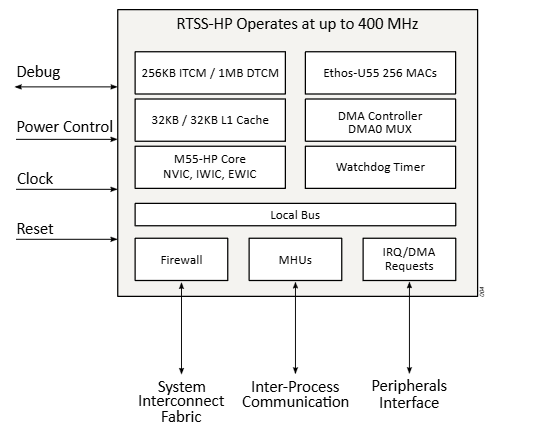
   
  <em>Hình 2.4: RTSS-HP architecture</em>

Việc triển khai Cortex-M55 trong RTSS-HE được tối ưu hóa để tiêu thụ dòng điện thấp khi chạy ở tốc độ lên đến 160 MHz và dòng điện rò rỉ cực thấp khi ở chế độ STANDBY. Cortex-M55 này được trang bị 256KB ITCM và 256KB DTCM để truy cập bộ nhớ một chu kỳ nhanh chóng (xem Hình 2-5). RTSS-HE nằm trong miền nguồn riêng của nó và có thể hoạt động độc lập với sự phụ thuộc tối thiểu vào các hệ thống con khác. Cả nội dung ITCM và DTCM đều có thể được giữ lại tùy chọn bằng đường ray nguồn dự phòng chuyên dụng khi toàn bộ miền nguồn RTSS-HE bị tắt nguồn, cho phép đánh thức nhanh chóng. RTSS-HE có một bộ thiết bị ngoại vi công suất thấp có thể đóng vai trò như một nguồn đánh thức và hỗ trợ các yêu cầu ứng dụng năng lượng cực thấp. Ethos-U55 microNPU bao gồm 128 MAC và có thể được sử dụng cho các ứng dụng dựa trên ML như phát hiện từ khóa, phân loại hình ảnh đơn giản, phát hiện bất thường, dự đoán lỗi, cảm biến môi trường và nhận dạng cử chỉ.

  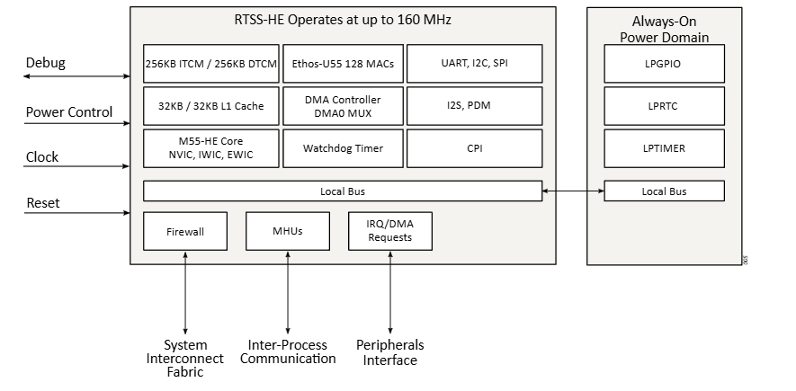
   
  <em>Hình 2.5: RTSS-HE architecture</em>

### 2.5. Shared Memory

Dòng thiết bị Ensemble tích hợp một lượng lớn SRAM được phân phối trên nhiều khối SRAM, mỗi khối có hiệu suất, băng thông và mức tiêu thụ điện năng khác nhau. Điều này được thực hiện để cho phép người dùng hoàn toàn linh hoạt để phân vùng bộ nhớ giữa các miền thực thi khác nhau dựa trên nhu cầu của ứng dụng của họ.

Mô tả về các kiểu bộ nhớ được miêu tả dưới hình 2.6:

| Loại bộ nhớ                      | Đặc điểm chính / Tóm tắt                                                                                                                                                                                      |
| :------------------------------- | :------------------------------------------------------------------------------------------------------------------------------------------------------------------------------------------------------------ |
| **Shared SRAM**                  | Gồm 2 khối (SRAM0 và SRAM1), dùng chung cho tất cả các lõi (cores) để cho phép truy cập đồng thời.                                                                                                            |
| **Backup SRAM**                  | Dung lượng **4KB**, chạy bằng nguồn VBAT để duy trì trạng thái hệ thống khi thức giấc (wakeup). Chỉ lưu dữ liệu (không chạy code), yêu cầu truy cập đọc/ghi chuẩn 32-bit.                                     |
| **Non-Volatile Memory (NVM)**    | Dùng công nghệ **MRAM**, cho phép lập trình chi tiết từng sector 16-byte. Hoạt động như RAM thông thường nếu ghi chuỗi 4 từ 32-bit liên tiếp.                                                                 |
| **External Memory**              | Mở rộng qua 1-2 cổng OSPI. Hỗ trợ chế độ **XIP** (chạy code trực tiếp từ bộ nhớ ngoài, ví dụ: Linux) và **HyperBus** (mở rộng RAM). Có tích hợp giải mã phần cứng **AES-256** theo thời gian thực để bảo mật. |
| **External Mass Storage**        | Mở rộng qua bộ điều khiển **SDMMC** (hỗ trợ thẻ SD/MMC 4-bit, eMMC 8-bit) hoặc **USB Host** (cho các ổ cứng/USB ngoài).                                                                                       |
| **Cache Memory**                 | Giúp tăng tốc APSS/RTSS. Lõi Cortex-A32 có **32KB L1 I/D** (tới 800MHz) và dùng chung **512KB L2** (tới 400MHz). Lõi Cortex-M55 có **32KB L1 I/D** (chỉ dùng khi truy cập ngoài vùng TCM).                    |
| **Tightly Coupled Memory (TCM)** | Tích hợp trong RTSS-HP/HE, cho phép truy cập tốc độ cao chỉ trong 1 chu kỳ. Chia thành **ITCM** (chứa lệnh) và **DTCM** (chứa dữ liệu), được ánh xạ bộ nhớ để các lõi khác cũng có thể truy cập.              |

Chi tiết về mapping địa chỉ cho bộ nhớ bạn có thể tham khảo docs của ALIF.
Các dải địa chỉ trong SRAM0 và SRAM1 có thể được hợp nhất bằng cấu hình MMU để nó xuất hiện dưới dạng vùng liền kề. Dòng thiết bị Ensemble có Tường lửa bảo mật các giao dịch giữa cổng chính và cổng phụ trên kết cấu kết nối chính (xem Hình 2.7).

  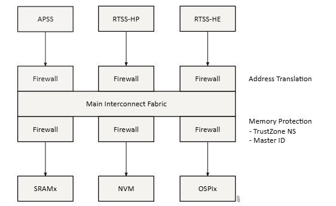
   
  <em>Hình 2.6: Kiến trúc tường lửa trên đường nối bộ nhớ</em>

### 2.6. Shared Peripherals

Hệ thống tích hợp hàng loạt thiết bị ngoại vi như: giao tiếp truyền dữ liệu (USB, Ethernet, CAN), bộ điều khiển màn hình, camera, âm thanh, bộ hẹn giờ và cổng I/O. Tất cả được đặt trong không gian địa chỉ toàn cục (Global Address Map), cho phép các lõi CPU (hệ thống con) khác nhau có thể cùng chia sẻ và truy cập.

**Để các lõi CPU có thể dùng chung ngoại vi mà không gây xung đột, hệ thống sử dụng 4 công cụ quản lý phần cứng:**

- **Bộ định tuyến ngắt (Interrupt Router)**: Làm nhiệm vụ "chỉ đường", quyết định xem lõi CPU nào sẽ nhận được tín hiệu cảnh báo (interrupt) từ một ngoại vi cụ thể.
- **Bộ định tuyến sự kiện / Dồn kênh DMA (Event Router / DMA Multiplexor)**: Chỉ định bộ điều khiển DMA nào sẽ thay mặt CPU tự động vận chuyển dữ liệu cho ngoại vi đó.
- **Bộ điều khiển xung nhịp (Clock Generation Controller)**: Phụ trách chia tần số tín hiệu phù hợp và tự động ngắt xung nhịp (tắt nguồn cục bộ) đối với các ngoại vi đang không được sử dụng để tiết kiệm pin tối đa
- **Tường lửa (Firewalls)**: Hoạt động như người gác cổng tuân thủ chuẩn bảo mật TrustZone
  . Nó kiểm tra danh tính của lõi CPU (thông qua Master ID) và chặn đứng mọi truy cập trái phép vào các ngoại vi đang được bảo vệ.

  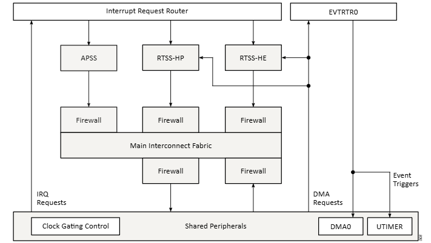
   
  <em>Hình 2.7: Kiến trúc chia sẽ ngoại vi trên E7</em>

Quản lý bảo mật tập trung Khi thiết bị hoạt động ở chế độ bảo mật (Secure state), quyền kiểm soát các ngoại vi dùng chung hay thậm chí là việc hoán đổi chức năng các chân cắm (pin multiplexing) đều bị khóa chặt. Các lõi ứng dụng muốn giành quyền điều khiển một ngoại vi nào đó buộc phải gửi yêu cầu cấp phép đến trung tâm bảo mật (Secure Enclave).

### 2.7. System Control

#### 2.7.1. Message Handling Units - MHU

Giao tiếp giữa các tiến trình (Message Handling Units - MHU) Các thiết bị Ensemble tích hợp nhiều hệ thống con độc lập, đòi hỏi phải có cơ chế chuyên dụng để chúng giao tiếp với nhau. MHU cung cấp giải pháp truyền tin dựa trên ngắt (interrupt-driven) theo mô hình điểm - điểm (point-to-point), cho phép gửi thông điệp xuyên qua các ranh giới miền điện năng và xung nhịp khác nhau. Cấu trúc này hỗ trợ các kênh dữ liệu an toàn (Secure) và không an toàn (Non-Secure) chuyên biệt.

  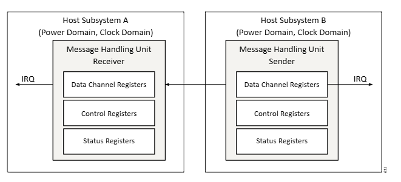
   
  <em>Hình 2.8: Cách MHUs hoạt động</em>

Dòng thiết bị Ensemble sử dụng hai cặp MHU để hỗ trợ IPC hai chiều giữa các phần tử xử lý. Để tuân thủ công nghệ TrustZone, số lượng MHU được tăng gấp đôi—cho phép cả kênh Bảo mật và Không an toàn chuyên dụng. Nói chung, cơ chế IPC giữa hai hệ thống con bất kỳ dựa trên tối đa tám phiên bản MHU được tổ chức trong hai kênh song công như trong Hình 2.9.

  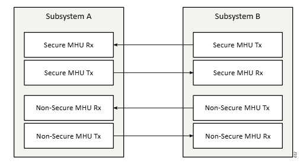
   
  <em>Hình 2.9: MHU Secure và Non-secure</em>

#### 2.7.2. Đồng bộ hóa phần cứng (Hardware Semaphores - HWSEM)

Khi nhiều hệ thống con cùng muốn truy cập vào một tài nguyên dùng chung (bộ nhớ, ngoại vi), phần cứng cung cấp các cờ hiệu (Semaphores) để tránh xung đột. Hệ thống bao gồm 16 module HWSEM hỗ trợ các thao tác Acquire (Giành quyền), Release (Nhả quyền), và Reset một cách nguyên tử (atomic), đảm bảo rằng tại một thời điểm chỉ có một lõi CPU được phép kiểm soát tài nguyên đó. Nếu tài nguyên đang bị chiếm, hệ thống sẽ tự động phát tín hiệu ngắt báo hiệu khi tài nguyên khả dụng trở lại.

#### 2.7.3. Định tuyến Ngắt và Sự kiện (Interrupt & Event Routers)

Bộ định tuyến ngắt (IRQRTR): Điều hướng tín hiệu ngắt từ các thiết bị ngoại vi dùng chung tới 4 thực thể xử lý chính (SESS, APSS, RTSS-HP, RTSS-HE). Việc cấu hình định tuyến này có thể bị khóa lại (lockdown) nhằm ngăn chặn các can thiệp trái phép, và trong trạng thái bảo mật, ứng dụng chỉ có thể thay đổi cấu hình ngắt thông qua dịch vụ của SESS
. Bộ định tuyến sự kiện (EVTRTR): Phân phối các tín hiệu kích hoạt sự kiện tới các bộ điều khiển DMA để tự động hóa việc luân chuyển dữ liệu.

#### 2.7.4. Giám sát Khởi động và Hệ thống (System Startup & Boot)

Khối bảo mật Secure Enclave Subsystem (SESS) đóng vai trò là Người giám sát Hệ thống (System Supervisor). Khi thiết bị vừa được cấp nguồn (Reset), SESS là khối duy nhất được khởi động trước, tất cả các lõi CPU khác đều bị giữ ở trạng thái chờ. SESS sẽ chịu trách nhiệm thiết lập các chính sách bảo mật, cấu hình chân cắm, xung nhịp và sau đó mới tiến hành quá trình khởi động an toàn (secure boot) cho các hệ thống con khác dựa trên cấu hình ATOC (Application Table of Contents) do nhà phát triển định nghĩa

  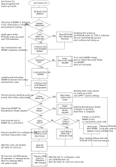
   
  <em>Hình 2.9: Quá trình khởi động</em>

## 3. Luồng dữ liệu (Data Flow)

### 3.1 Luồng dữ liệu cơ bản trên ALFI MCU

Bus AXI chính: Giải thích về giao thức bus AXI4 hiệu suất cao với độ rộng 64-bit, hoạt động ở tần số 400 MHz, cho phép kết nối song song các cổng master (CPU, DMA) và slave (bộ nhớ, ngoại vi).

Bảo mật và Tường lửa (Firewalls): Luồng dữ liệu khi truyền qua bus được giám sát chặt chẽ bởi các Tường lửa. Các tường lửa này thực hiện lọc giao dịch (transaction gating) dựa trên Master ID, trạng thái bảo mật TrustZone, và đảm nhiệm việc dịch địa chỉ (address translation) để cung cấp cho mỗi hệ thống con một không gian địa chỉ toàn cục (global address map) phù hợp
.

  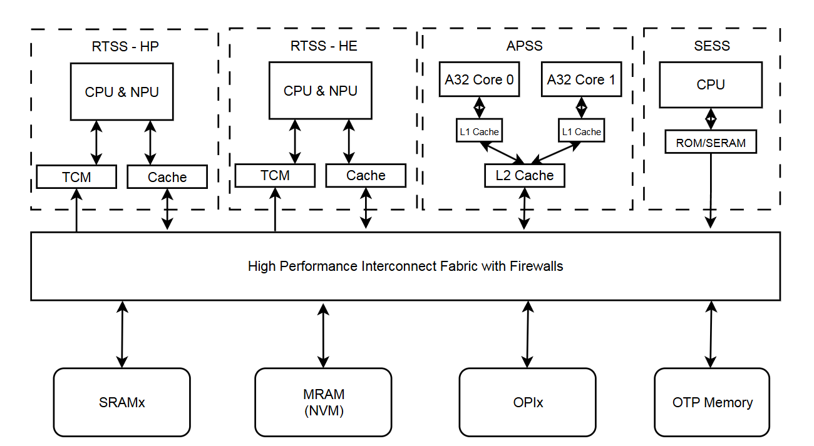
   
  <em>Hình 3.1: Tổng quan về đường đi dữ liệu trên E7</em>

Trong đường truyền dữ liệu của MCU E& một cơ chế xuất hiện xuyên suốt và rất tốt cho việc xử lý real-time và ít tốn năng lượng là DMA (Direct Memory Access). DMA là cơ chế cho phép ngoại vi hoặc bộ điều khiển DMA tự truyền dữ liệu trực tiếp với bộ nhớ (RAM) mà không cần CPU xử lý từng byte. Giải tải CPU và quan trọng nhất là không tốn thời gian cho việc ghi dữ liệu vào bộ nhớ.

### 3.2 Luồng dữ liệu xử lý trên MCU E7

Các tác vụ được xử lý riêng biệt và các subsystems giao tiếp với nhau thông MHUs và cơ chế ngắt (IRQs). Phía dưới là hình ảnh mô tả về quy trình xử lý trên E7 và mô tả chi tiết từng quá trình. Về cơ bản dữ liệu sẽ được xử lý tuần tự theo các bước dưới, tuy nhiên việc dữ liệu được xử lý bởi RTSS nào HP hay HE thì phụ thuộc vào người lập trình và kiến trúc phần mềm nạp xuống. Tóm lại, phần cứng cung cấp các công cụ (TCM độc lập, Mailbox, bộ quản lý năng lượng), nhưng chính bản đồ bộ nhớ và cấu trúc code của bạn mới là thứ "chỉ định" lõi nào được phép làm gì.

  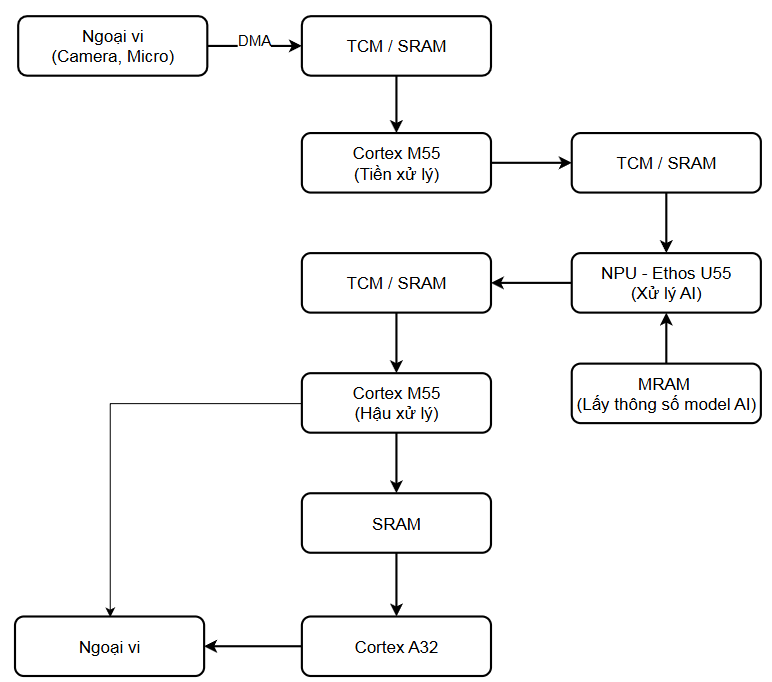
   
  <em>Hình 3.2: Luồng dữ liệu xử lý trên E7</em>

1. **Thu thập dữ liệu (Data Acquisition)**

- Thiết bị ngoại vi (như Camera, Micro) thu thập dữ liệu thô.  
- Dữ liệu này được đẩy thẳng vào bộ nhớ TCM / SRAM thông qua kênh truyền DMA (Direct Memory Access) để CPU không phải can thiệp, giúp tiết kiệm tài nguyên. 
- Nếu dữ liệu nhỏ vào được TCM sẽ ưu tiên vào TCM nếu không sẽ vào SRAM
2. **Tiền xử lý (Preprocessing)**

- Vi điều khiển Cortex M55 đọc dữ liệu thô từ TCM/SRAM để thực hiện các tác vụ tiền xử lý (ví dụ: resize ảnh, lọc nhiễu âm thanh).
- Xử lý xong, Cortex M55 lưu dữ liệu đã "sạch" trở lại vào TCM / SRAM để chuẩn bị cho AI.
- Sau đó nó sử tín hiệu cho NPU dạng "Dữ liệu nằm ở X, xử lý xong lưu dữ liệu vào lại Y" trên TCM/SRAM
3. **Xử lý AI / Suy luận (AI Processing)**

- Đây là trái tim của hệ thống. Bộ vi xử lý AI chuyên dụng NPU - Ethos U55 sẽ làm 2 việc cùng lúc:
- Lấy dữ liệu đầu vào (đã tiền xử lý) từ TCM / SRAM.
- Kéo các thông số/trọng số của mô hình AI từ bộ nhớ MRAM.
- NPU thực hiện tính toán và ghi kết quả dự đoán (output) ngược trở lại TCM / SRAM.

4. **Hậu xử lý (Post-processing)**

- Cortex M55 lại tiếp tục vào việc. Nó đọc kết quả AI từ TCM/SRAM để dịch ra thông tin dễ hiểu (ví dụ: tính toán tọa độ khung hình, quyết định xem giọng nói đó là lệnh gì).  
5. **Xuất kết quả & Điều khiển (Output / Control)**  
Tùy vào độ phức tạp của tác vụ, dữ liệu sau hậu xử lý có thể đi theo 2 hướng:
    - Hướng 1 (Tốc độ cao / Đơn giản): Cortex M55 trực tiếp ra lệnh cho thiết bị Ngoại vi (ví dụ: bật đèn, đóng/mở relay)
    - Hướng 2 (Phức tạp / Đòi hỏi HĐH): Cortex M55 đẩy dữ liệu qua một SRAM chung để báo cáo cho vi xử lý mạnh hơn là Cortex A32 (thường chạy Linux). Cortex A32 sẽ lo các việc nặng như hiển thị UI, đẩy dữ liệu lên cloud, rồi mới điều khiển Ngoại vi.
---

## ⚡ 4. Hardware Showcase: DevKit vs AppKit

Dòng Ensemble E7 hiện có hai biến thể phần cứng phổ biến cho nhà phát triển:  
 [Tài liệu tham khảo User Guide cho DevKit](https://www.bing.com/ck/a?!&&p=0f1e79fc1e4bde63991911496e1deb26920984526b9416a575c9dee5c5086fd0JmltdHM9MTc3NDgyODgwMA&ptn=3&ver=2&hsh=4&fclid=02dea0dd-a511-68d8-1534-b632a4fa699e&psq=Alif+Ensemble+DevKit+User+Guide&u=a1aHR0cHM6Ly9hbGlmc2VtaS5jb20vZG93bmxvYWQvQVVHRDAwMTA)

### 🔴 Alif Ensemble E7 DevKit (Full-featured)

  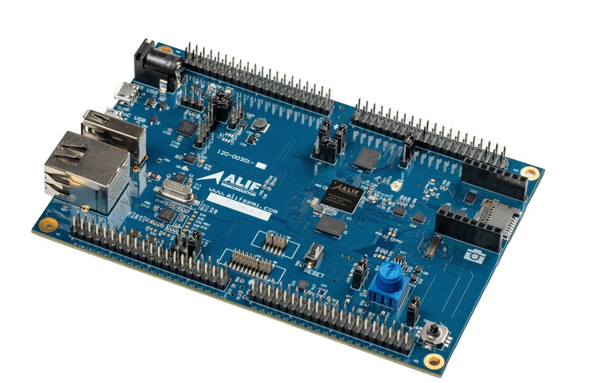
Đây là phiên bản đầy đủ nhất về mặt tín hiệu điện, được thiết kế chủ yếu cho các kỹ sư phần cứng và hệ thống trong giai đoạn R&D.  

**Đặc điểm**: Thiết kế của DevKit tập trung vào việc đưa càng nhiều tín hiệu càng tốt ra các hàng rào cắm (headers) để tạo nguyên mẫu (prototyping), đo lường và kiểm tra hiệu năng. Nó có đầy đủ các cổng giao tiếp như JTAG, UART, Ethernet, khe cắm thẻ SD, USB, cùng các header chờ cho MIPI CSI/DSI, I2S, PDM Mics,.  

**Tính năng đặc biệt**: DevKit sử dụng chip E7 "superset" (cấu hình cao nhất). Điểm thú vị là MCU trên bộ kit này có thể được cấu hình phần mềm để hoạt động mô phỏng như các dòng chip thấp hơn (ví dụ: E6, E5, E4, E3, E1). Nhờ đó, nhà phát triển có thể thử nghiệm mọi kịch bản chip trên cùng một bo mạch duy nhất.  

**Mục tiêu**: Thử nghiệm chuyên sâu mọi chức năng của vi điều khiển, kiểm tra tín hiệu điện, gỡ lỗi (debug) cấu hình hệ thống trước khi thiết kế PCB tùy chỉnh.

### 🔵 Alif Ensemble E7 AppKit (Targeted)

  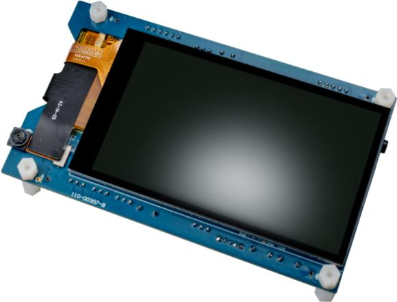
Đây là phiên bản tối ưu hóa cho việc phát triển phần mềm và xây dựng sản phẩm mẫu nhanh chóng, đặc biệt tập trung vào các ứng dụng AI/Machine Learning tại biên (Endpoint ML).

**Đặc điểm**: Không giống như DevKit yêu cầu cắm thêm module, AppKit được tích hợp sẵn (on-board) các phần cứng ngoại vi quan trọng bao gồm: một camera/cảm biến hình ảnh giao tiếp MIPI-CSI (hỗ trợ quay video hoặc chụp ảnh), một màn hình LCD màu chuẩn WVGA, 4 microphone thu âm và cảm biến chuyển động IMU.  

**Hỗ trợ phần mềm**: Được đi kèm với bộ Software SDK hỗ trợ đầy đủ driver cho mọi ngoại vi trên bo mạch, giúp lập trình viên bỏ qua bước "build phần cứng" mà bắt tay ngay vào viết ứng dụng.  

**Mục tiêu**: Trải nghiệm ngay sự gia tăng hiệu năng của NPU Ethos-U55, dùng để triển khai nhanh các mô hình AI nhận diện hình ảnh, xử lý giọng nói, hoặc giao diện đồ họa HMI (Human-Machine Interface).

---
